# [WeAreMillions](https://wearemillions.org)

WeAreMillions is a massive photo campaign by The Courage Foundation to demonstrate global support for WikiLeaks. This website allows users to upload photos of them holding signs to express simply and clearly why they are standing up for Julian Assange, whom the US seeks to punish for publishing hundreds of thousands of diplomatic cables and military documents in 2010. When uploading, users can enter their name, photo description/quote and add tags. Photos can be shared directly from the website to Facebook and Twitter and users can create photo collages containing 9 photos they can choose. If so chosen when uploading, photos can be added to the public gallery after admins have approved them regarding which the uploader is notified via email. Admins have access to the admin panel where they can view and edit all the photos, move them to another categories, change its order and delete them.

## Duration
- 30.6.2019. - 10.7.2019.
- 1.8.2019. - 16.8.2019.
- 1.2.2020. - 10.2.2020.

## Technologies used
- HTML
- CSS
- JavaScript
- jQuery
- AJAX
- PHP
- MySQL
- Bootstrap Framework

## Features
- users can upload their photos and enter tags, description and their name (optional)
- when uploading, photos can be cropped and resized
- photos can be searched by uploader's name or by entered tags
- photos can be sorted by categories (Featured, Newest, Oldest, Supporter Photos)
- photos can be shared on Facebook and Twitter directly from the website
- if user enters his email when uploading the photo, he will be notified whether his photo has been approved or disapproved
- users can create photo collage out of 9 chosen photos, which can then be shared on Facebook or Twitter
- admins can approve, disapprove, edit and manage uploaded photos in the admin panel
- admins can create moderators who can also approve, disapprove, edit and manage uploaded photos
- admins and moderators can recrop and resize uploaded photos
- photos are smoothly loaded as you scroll down the page
- multiple languages supported - each language (English, French, German, Spanish, Portuguese) has its own featured photos category
- photos in the featured photos category can be reordered in the admin panel
 
## Screenshots

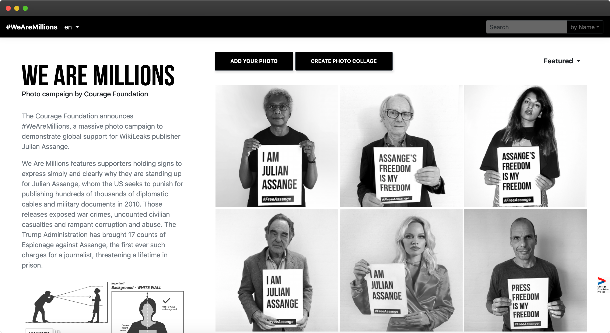
*WeAreMillions index page*

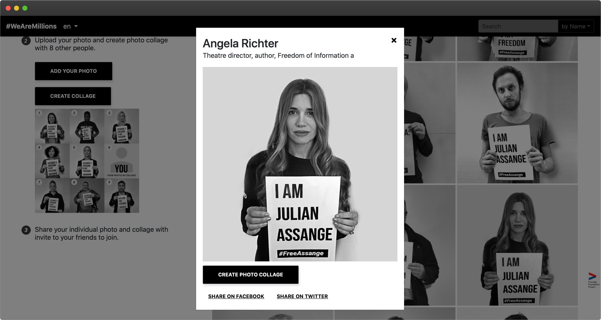
*Viewing a photo*

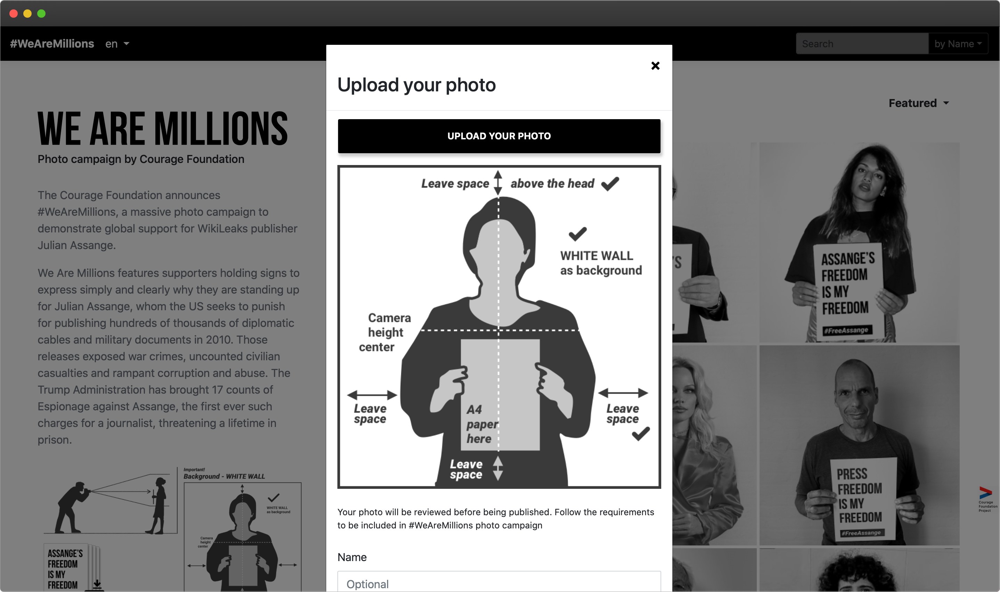
*Uploading a new photo*

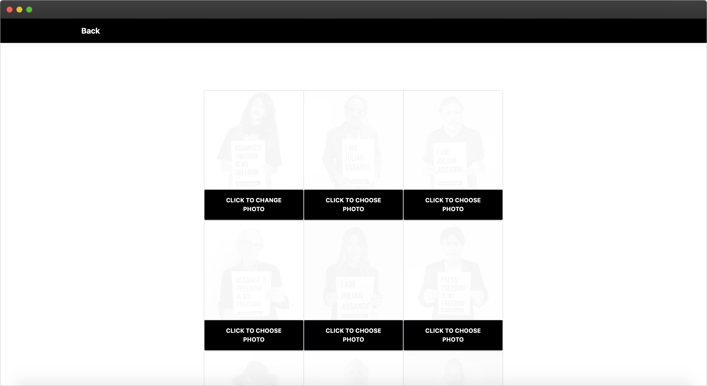
*Choosing photos when creating a photo collage*

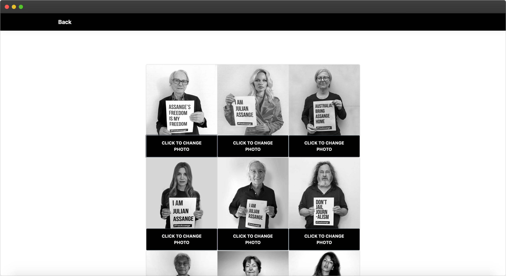
*Choosing photos when creating a photo collage*

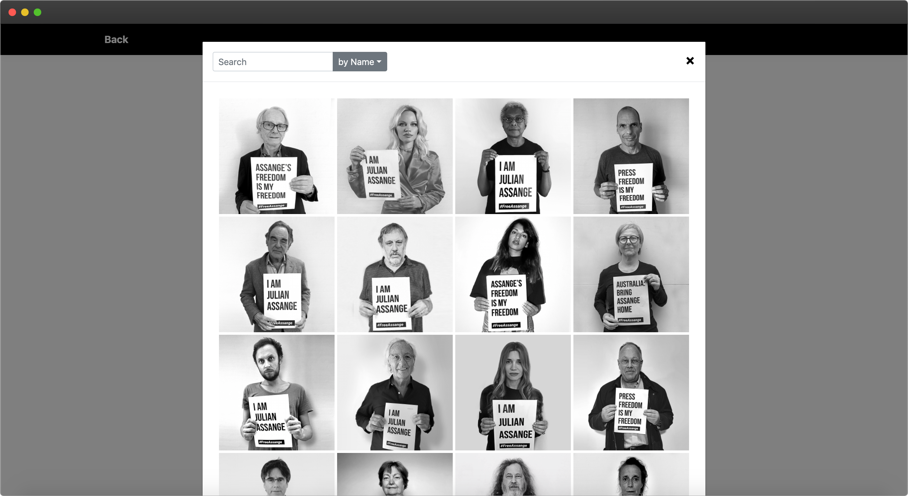
*Searching for photos to choose from when creating a photo collage*

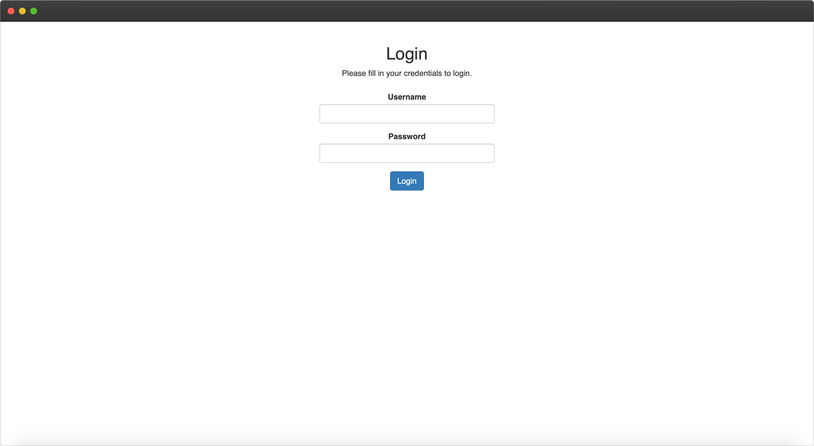
*Login form for the admin panel*

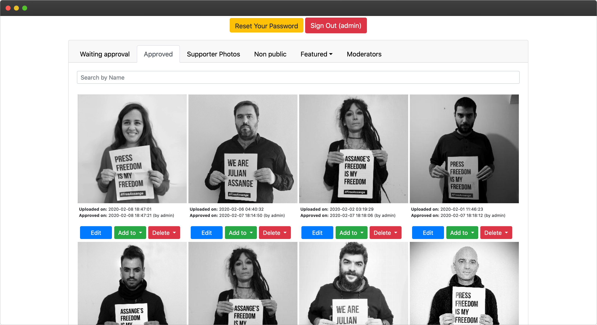
*Approved photos as seen in the admin panel*

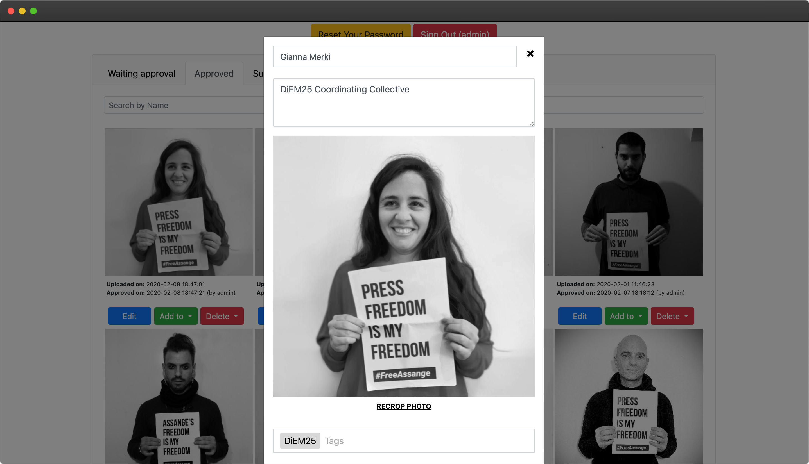
*Editing a photo in the admin panel*

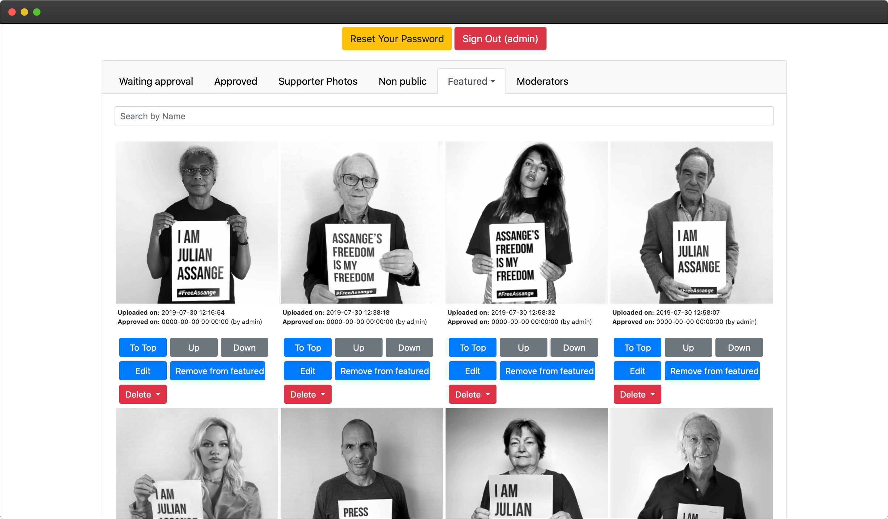
*Featured photos as seen in the admin panel*

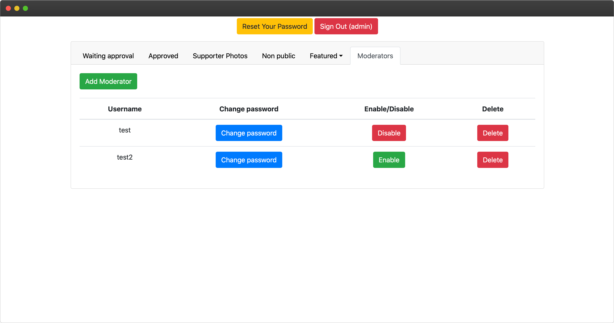
*List of moderators as seen in the admin panel*

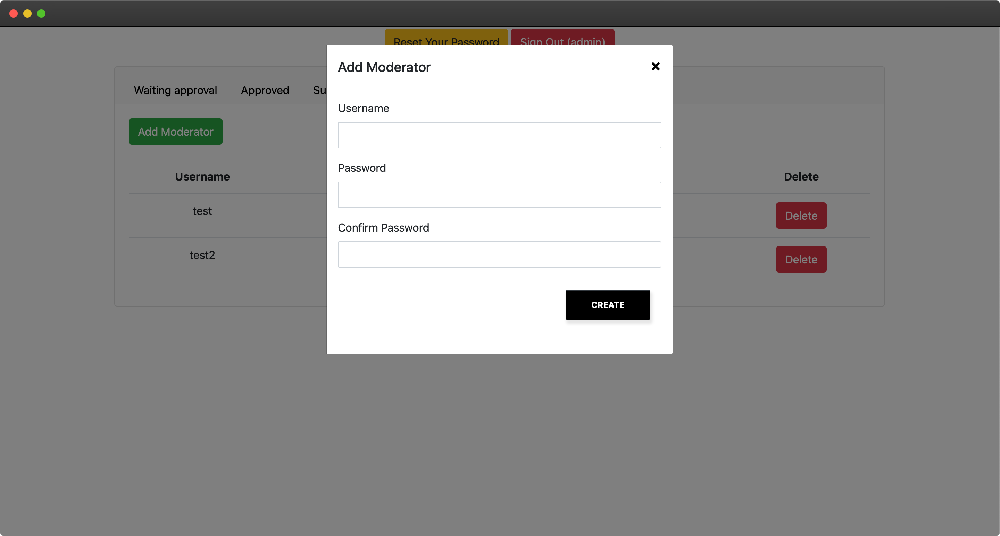
*Adding a new moderator in the admin panel*
